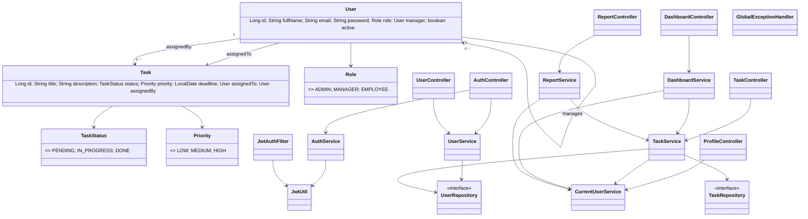

# Class Diagram (backend)

```mermaid
classDiagram
    class User { Long id; String fullName; String email; String password; Role role; User manager; boolean active }
    class Task { Long id; String title; String description; TaskStatus status; Priority priority; LocalDate deadline; User assignedTo; User assignedBy }
    class Role { <<enumeration>> ADMIN; MANAGER; EMPLOYEE }
    class TaskStatus { <<enumeration>> PENDING; IN_PROGRESS; DONE }
    class Priority { <<enumeration>> LOW; MEDIUM; HIGH }

    class AuthController
    class UserController
    class TaskController
    class DashboardController
    class ReportController
    class ProfileController
    class AuthService
    class UserService
    class TaskService
    class DashboardService
    class ReportService
    class CurrentUserService
    class UserRepository { <<interface>> }
    class TaskRepository { <<interface>> }
    class JwtUtil
    class JwtAuthFilter
    class GlobalExceptionHandler

    User "1" --> "0..*" User : manages
    User "1" --> "0..*" Task : assignedTo
    User "1" --> "0..*" Task : assignedBy
    User --> Role
    Task --> TaskStatus
    Task --> Priority

    AuthController --> AuthService
    AuthController --> UserService
    UserController --> UserService
    TaskController --> TaskService
    DashboardController --> DashboardService
    ReportController --> ReportService
    DashboardService --> TaskService
    ReportService --> TaskService
    ProfileController --> CurrentUserService
    TaskService --> CurrentUserService
    DashboardService --> CurrentUserService
    ReportService --> CurrentUserService
    AuthService --> JwtUtil
    UserService --> UserRepository
    TaskService --> TaskRepository
    TaskService --> UserRepository
    JwtAuthFilter --> JwtUtil
```
