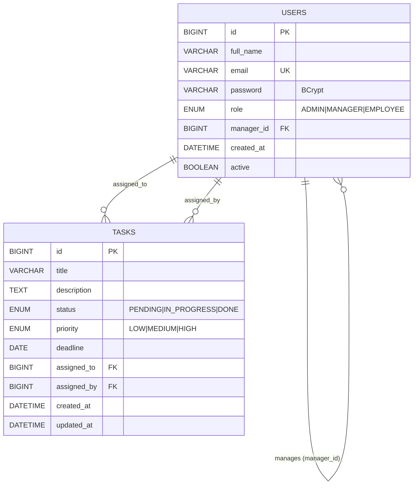

# ER Diagram

```mermaid
erDiagram
    USERS ||--o{ USERS : "manages (manager_id)"
    USERS ||--o{ TASKS : "assigned_to"
    USERS ||--o{ TASKS : "assigned_by"

    USERS {
        BIGINT id PK
        VARCHAR full_name
        VARCHAR email UK
        VARCHAR password "BCrypt"
        ENUM role "ADMIN|MANAGER|EMPLOYEE"
        BIGINT manager_id FK
        DATETIME created_at
        BOOLEAN active
    }
    TASKS {
        BIGINT id PK
        VARCHAR title
        TEXT description
        ENUM status "PENDING|IN_PROGRESS|DONE"
        ENUM priority "LOW|MEDIUM|HIGH"
        DATE deadline
        BIGINT assigned_to FK
        BIGINT assigned_by FK
        DATETIME created_at
        DATETIME updated_at
    }
```
