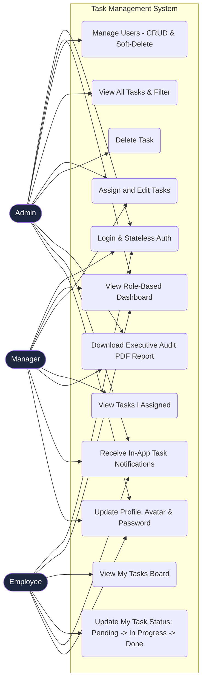

# Use Case Diagram

```mermaid
flowchart LR
    A([Admin]):::actor
    M([Manager]):::actor
    E([Employee]):::actor

    subgraph System[Task Management System]
        L(Login & Stateless Auth)
        D(View Role-Based Dashboard)
        U(Manage Users - CRUD & Soft-Delete)
        T1(View All Tasks & Filter)
        T2(Assign and Edit Tasks)
        T3(View Tasks I Assigned)
        T4(View My Tasks Board)
        T5(Update My Task Status: Pending -> In Progress -> Done)
        T6(Delete Task)
        R(Download Executive Audit PDF Report)
        N(Receive In-App Task Notifications)
        P(Update Profile, Avatar & Password)
    end

    A --> L & D & U & T1 & T2 & T6 & R & N & P
    M --> L & D & T2 & T3 & R & N & P
    E --> L & D & T4 & T5 & N & P
    classDef actor fill:#1d2740,color:#fff
```
